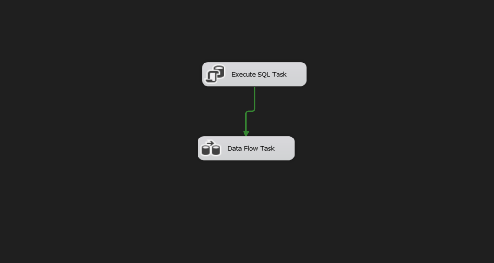
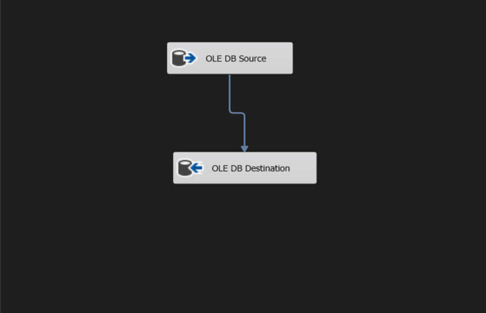
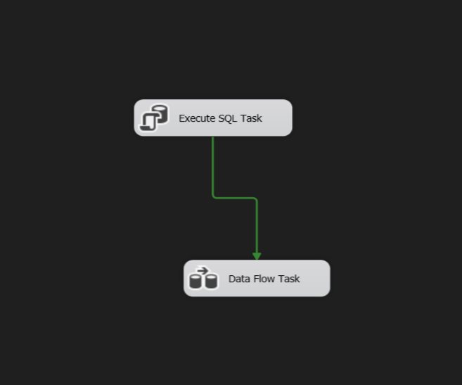
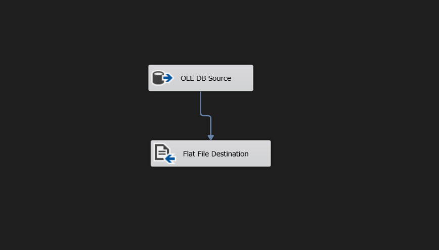
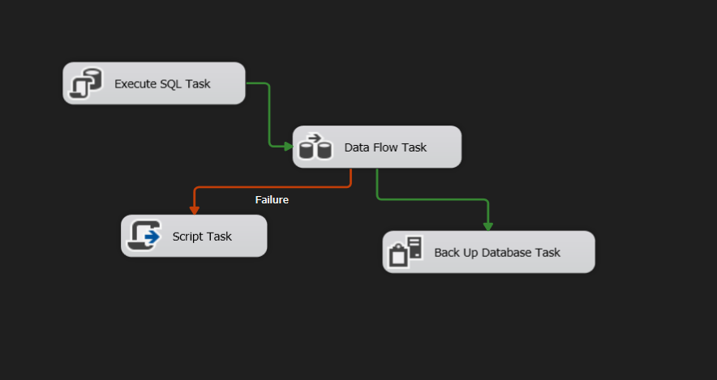
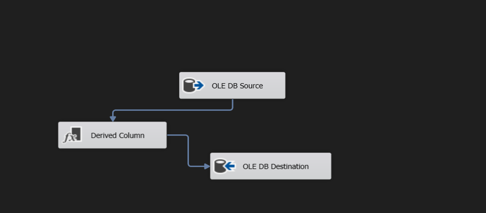
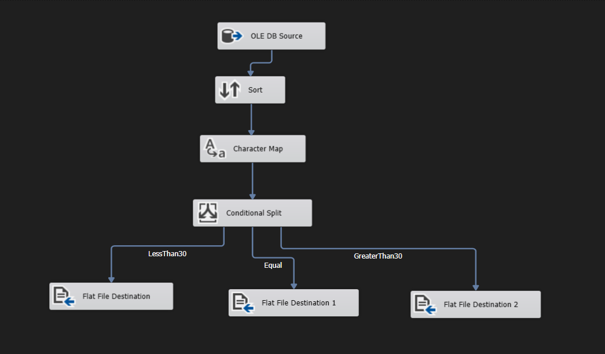
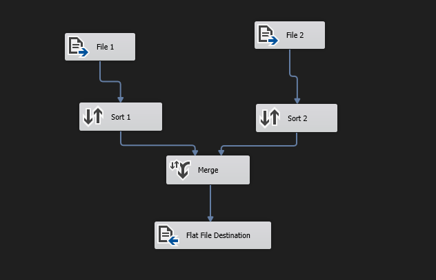
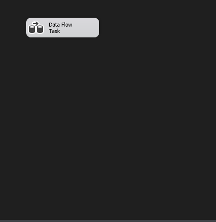
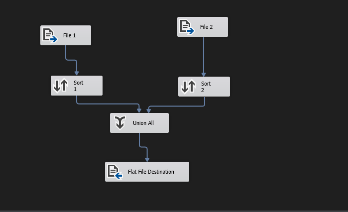

# SSIS Package Designs for Data Transfer and Transformation

This repository contains the design and implementation of various SQL Server Integration Services (SSIS) packages as part of a data migration and transformation project using data from the **ITI DB** and **Test DB**.

## 📦 Project Overview

The project includes 5 key SSIS packages, each addressing a different ETL (Extract, Transform, Load) scenario using SSIS tools like the Import/Export Wizard, Derived Column, Character Map, Merge, Union, and various control flow components.

---

## 📁 Package 1: Transfer Department Data

**Goal**: Transfer the `Department` table from **ITI DB** to **Test DB** using the SSIS Import/Export Wizard.

**Steps**:
- Truncate the `Department` table in **Test DB** before data transfer.
- Use the **SSIS Wizard** to move the data.

**📸 Screenshots**:

  

---

## 📁 Package 2: Export Student Data to Delimited File

**Goal**: Export selected student information into a `.txt` file.

**Steps**:
- Select columns: `St_id`, `St_Fname`, `St_lname`, `St_address` from **ITI DB**.
- Export to `Student.txt` in a **Delimited** format.
- Set **column names as the first row** in the output file.
- Use the **SSIS Wizard**.

**📸 Screenshots**:

  

---

## 📁 Package 3: Advanced Student Data Transfer with Transformation

**Goal**: Transfer and transform `Student` data from **ITI DB** to **Test DB** with validation and backup.

**Steps**:
1. **Check if the `Student` table exists** in **Test DB**:
   - If yes, **delete all existing records** using **Execute SQL Task**.
2. **Merge First Name and Last Name** into a single column called `Full Name`:
   - Use **Derived Column Component**.
3. **Perform a full backup** of **Test DB** before loading.
4. Handle errors gracefully:
   - On any failure, **display a message box**: `"Error occurred"`.

**📸 Screenshots**:

  

---

## 📁 Package 4: Split Course Data into Multiple Files

**Goal**: Extract, transform, and split `Course` data into 3 files based on course duration.

**Steps**:
1. Select `Course` data along with `Topic Name` from **ITI DB**.
2. **Sort** by `Crs_name` in **descending** order using the **Sort Component**.
3. Convert `Crs_name` to **lowercase** using the **Character Map Component**.
4. Split data into 3 output files:
   - `File1.txt`: Courses with duration **< 30 hours**
   - `File2.txt`: Courses with duration **= 30 hours**
   - `File3.txt`: Courses with duration **> 30 hours**
5. All output files must:
   - Be **Delimited**
   - Include **column names as the first row**

**📸 Screenshot**:

---

## 📁 Package 5: Combine Course Files

This task includes two variations of combining `File1.txt` and `File2.txt` into a single file using different SSIS components.

---

### 📄 5.1 Merge Course Files Using [Merge Component]

**Goal**: Merge `File1.txt` and `File2.txt` in sorted order.

**Steps**:
- Ensure both input files are **sorted by `Crs_name`** in ascending order.
- Use the **Merge Component** in the Data Flow.
- Output a single delimited file with **column names as the first row**.

**📸 Screenshots**:

  

---

### 📄 5.2 Union Course Files Using [Union All Component]

**Goal**: Combine `File1.txt` and `File2.txt` without enforcing order.

**Steps**:
- Use the **Union All Component** to concatenate data from both files.
- Sorting is **not required**.
- Output a single delimited file with **column names as the first row**.

**📸 Screenshots**:

  

---

## 🛠️ Tools Used

- SQL Server Integration Services (SSIS)
- SSIS Import and Export Wizard
- SQL Server Management Studio (SSMS)

## ▶️ How to Use the SSIS Packages

Follow the steps below to run and test the SSIS packages included in this project.

### 1. 📦 Requirements
Ensure the following are installed on your system:
- **SQL Server** (with [ITI DB] and [Test DB] created and populated)
- **SQL Server Data Tools (SSDT)** via **Visual Studio**
- **SSIS Projects Extension** installed in Visual Studio

---

### 2. 🛠️ Configuration Steps

#### ⚙️ Open the Project
- Open Visual Studio.
- Go to `File` → `Open` → `Project/Solution`.
- Select the `.sln` file for your SSIS solution or open individual `.dtsx` packages.

#### 🔄 Update Connection Strings
- Right-click on each **Connection Manager** at the bottom of the SSIS package design view.
- Edit the connection string to match your local or server database settings:
  - Replace placeholders like `.\SQLEXPRESS`, `localhost`, or hardcoded database paths.

#### 💾 Prepare the Environment
- Ensure `ITI DB` and `Test DB` exist and contain the required schema.
- Create or clear the target text files (`Student.txt`, `File1.txt`, etc.) if needed.

---

### 3. ▶️ Run the Packages

#### 🧪 From Visual Studio:

- Open the desired `.dtsx` file.
- Click **Start Debugging (F5)**.
- Monitor the **Execution Results** tab for any errors or success messages.

---

### 4. 📁 Output Locations

- **Delimited files** (like `Student.txt`, `File1.txt`, etc.) are written to the file system.
- Make sure you have write permissions to the specified directories.
- Verify outputs and logs after execution.

---

